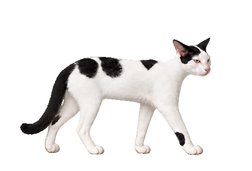
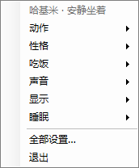

# 哈基米桌宠

一只瘦长、脾气不太好的黑白猫。它会在 Windows 桌面上睡觉、溜达、盯鼠标、空嚼低吼、哈气，还会把回收站当饭盆。



## 下载与运行

在本仓库的 **Releases** 页面下载 `哈基米.exe`，双击运行。当前版本 **v0.4.0**，适用于 Windows x64。

EXE 内含运行环境、图片和音频，无需另外安装 .NET，也无需外部素材文件夹。源码仓库不包含编译好的 EXE。

## 功能

- 透明、无边框桌宠；猫可点击与拖动，周围透明区域允许鼠标穿透。
- 睡觉、醒来、走动、观察鼠标、空嚼、哈气、坐立、摆烂、进食与舔毛。
- 好猫模式：自己玩，保留右键菜单和拖动。
- 自动或手动去回收站找饭。空时等饭喵叫，有内容时播放进食动画，吃饱后低鸣。**不会删除回收站文件。**
- 大小滑块、可选置顶、静音、睡觉打呼噜、自定义或随机睡眠时间。
- 可选叼走鼠标：默认关闭；启用后连续挑衅可触发，最多 8 秒。**Esc 释放，空格嘎蛋并释放。**
- 可选开机自启：默认关闭，在“显示 → 开机自启”中设置，用户登录 Windows 后启动。



| 菜单 | 内容 |
|---|---|
| 动作 | 叫醒、睡觉、烂抹布、站着或坐着蔑视 |
| 性格 | 好猫模式、叼走鼠标、挑衅次数、装回铃铛 |
| 吃饭 | 自动进食、去找饭、饭盆状态、寻找回收站 |
| 声音 | 静音、睡觉打呼噜、音量 |
| 显示 | 置顶、大小、移回屏幕、开机自启 |
| 睡眠 | 固定时间、随机、自定义 |

完整操作说明见 [使用说明](docs/使用说明.md)。

## 从源码构建

需要 Windows 和 .NET 10 SDK；普通运行不需要 SDK。

```powershell
# 检查行为、素材与交互规则
dotnet run --project tests/Hajimi.Tests -c Release

# 生成包含运行环境的单文件 EXE
powershell -ExecutionPolicy Bypass -File tools/package.ps1
```

输出为根目录 `哈基米.exe`。重新打包前请退出这一位置正在运行的桌宠。也可用 `tools/build.ps1` 一次完成测试与打包。

## 目录

```text
src/Hajimi/         桌宠源码与发布配置
tests/Hajimi.Tests/ 验证程序
assets/            角色配置、参考图、动画图集、WAV
素材/音频/         原始 MP3，可重新转换
tools/             构建、打包与素材处理脚本
docs/              使用说明、设计与生成记录、预览
图标.ico            EXE 和托盘图标
```

运行设置保存在 `%LOCALAPPDATA%/Hajimi/settings.json`。

- [模块设计](docs/模块设计.md)
- [素材说明](docs/素材说明.md)
- [构建与验证](docs/构建与验证.md)
- [GitHub 发布步骤](docs/GitHub发布.md)
- [更新记录](CHANGELOG.md)

## 许可证

本仓库使用 [MIT 许可证](LICENSE)。图片与音频的来源记录见 [素材说明](docs/素材说明.md)。
