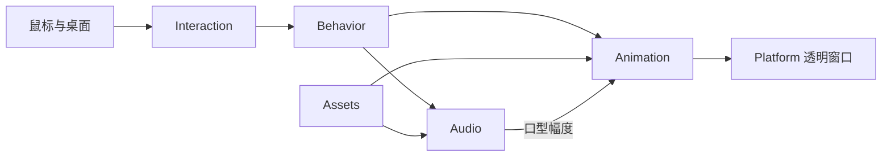

# 模块设计

程序使用 C# / .NET 10 WinForms 和 Win32 逐像素透明窗口。角色行为、渲染与平台交互分开。

| 模块 | 职责 |
|---|---|
| Behavior | 状态、计时、追踪距离、饥饿、挑衅与好猫模式 |
| Animation | 选择姿态、整帧行走、头部跟踪、下颌动作 |
| Interaction | 鼠标观察、拖动、找饭导航、可选鼠标捕获与释放 |
| Audio | WAV 读取、声音选择、独立音量与口型幅度 |
| Assets | JSON 配置、外部或嵌入素材读取、姿态缓存 |
| Platform | 透明窗口、菜单、设置、托盘、屏幕、回收站、自启动 |
| Diagnostics | 静音窗口演练、预览与输入探测 |

## 主要行为

默认蜷缩睡觉。醒来后随机走动，观察附近鼠标，持续停留后凑近并空嚼低吼。点击按当前姿态触发反应；单次哈气后恢复，多次哈气可触发正常脖子的咂嘴。空闲直接睡回待机状态。

好猫模式与嘎蛋状态不追鼠标、不哈气、不抢鼠标；菜单和拖动仍可用。自动进食根据上次吃饱后的时间计时，关闭开关仍可手动找饭。回收站只查询位置和数量。

## 行走

八张完整 PNG 在固定画布上播放；腿部不单独裁切或拉伸。帧序号由实际移动距离决定，停止移动也停止换帧。整张图镜像完成左右方向切换，嘴部锚点随镜像和大小一起变化。

## 设置与启动

偏好设置保存在当前用户的 LocalAppData，使用临时文件写入后替换。开机自启使用当前用户 Run 中的 `Hajimi.DesktopPet`，单独读取真实开关状态；普通偏好设置保存不会开启自启。

## 增加姿态

在 `assets/character.json` 配置素材和尺寸，向 `PetState`、`PetBrain`、`PetAnimator` 添加对应行为与绘制规则。声音选择由 `AudioPolicy` 管理。行走序列须保持相同画布，避免逐帧裁边导致比例变化。
