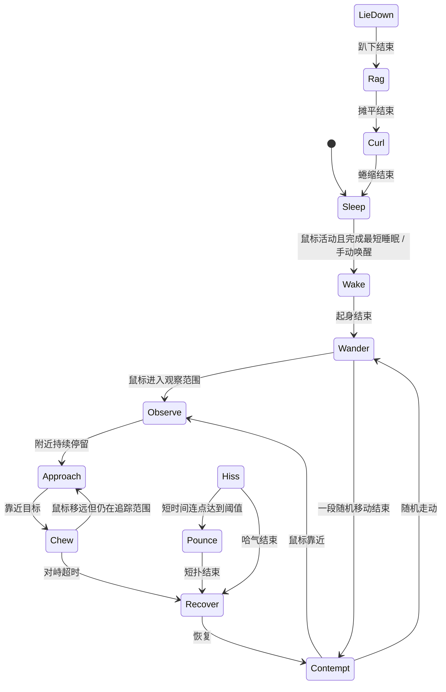

# 哈基米：角色与第一阶段设计

## 参考图检查

五张原图均为 RGBA 透明 PNG，原件保持不动，副本放在 `assets/reference`。

| 状态 | 文件 | 尺寸 | 角色约束 |
|---|---|---|---|
| sleep | 待机状态.png | 1191 × 720 | 蜷缩、脸埋进前腿、黑尾环绕身体，默认状态 |
| contempt | 蔑视状态.png | 1117 × 1025 | 长腿、窄脸、半眯眼；清醒时的主姿态 |
| chew | 嚼口香糖形态.png | 1228 × 531 | 长躯干、明显前伸的脖子、低头；不用哈气图代替 |
| hiss | 炸毛哈气.png | 745 × 671 | 耳后压、张嘴、背毛竖起；只有这里可以明显弓背 |
| rag | 烂抹布状态.png | 1242 × 218 | 背过头、身体摊平、长尾长腿，不能画成可爱趴姿 |

共同标记：黑色双耳与头顶两侧，额头白色中缝，白色口鼻，粉鼻，浅灰绿眼睛；白身黑背斑、黑尾；近侧前腿下段黑斑。原图不同姿态的背斑数量和透视并非完全一致，新增素材应参考站姿的主要斑块位置，不把它们重新设计成五只猫。

优先级：角色一致性 > 怪异比例 > 关键姿态辨识度 > 动画连贯度。保留原图作为五个关键状态；新增 PNG 仅补起身、步态和趴下。低帧率、有停顿，不做弹跳卖萌。

## 第一阶段状态图

任意可交互状态：点击立即进入 Hiss；空闲超时进入 LieDown；拖动暂停自主移动。鼠标突然靠近只在清醒且冷却结束时触发一次 Hiss，避免它主动接近静止鼠标时误触发。点击可打断过渡。连点阈值右键可调。

## 技术与模块

- C# / .NET 10 Windows Forms，无第三方运行库包。使用 Win32 `UpdateLayeredWindow` 的逐像素透明窗口，无边框、置顶、不激活，不抢键盘焦点。透明像素由系统穿透，猫实体接收点击。
- `Behavior`：纯状态机、计时、距离判定、随机游走、连点升级，可用模拟时间测试。
- `Animation`：8 fps 左右姿态变化、原图局部头颈/下颌变形、姿态衔接，窗口位置单独更新。
- `Interaction`：读取真实鼠标位置与系统空闲时间、点击/拖动识别；不设置系统鼠标位置。
- `Audio`：chew 循环低吼、hiss 短音、淡入淡出/静音；MVP 使用合成占位声，可替换 WAV。
- `Assets`：JSON 描述帧与原图，缓存载入，缺少可选补帧时回退原图；缺少关键原图时报清晰错误。
- `Platform`：透明窗口、工作区边界、混合 DPI、多显示器拖放、托盘退出。

## 交互取舍

原提案的点击行为冲突：本版采用“停留 → chew，点击 → hiss，连点 → 短扑”。不接管鼠标，不拦截全局空格键；抢鼠标与所谓“噶蛋”不属于第一阶段。保留右键“趴成抹布”、睡觉、唤醒、静音、大小、连点阈值、空闲时间与退出。

默认先睡。正常鼠标活动后醒来并短暂游走；附近停留后观察、接近、伸脖子空嚼。持续不理猫或系统空闲会趴下、摊平并睡回去。一次互动有时限，静止鼠标不会让猫永远低吼。

多显示器：猫在当前显示器工作区活动，可以拖到其他显示器；拔掉显示器会回到有效工作区。第一阶段不自动跨越显示器间的空隙。

## Windows API 依据

- [Microsoft：Layered Windows 与 alpha 命中测试](https://learn.microsoft.com/en-us/windows/win32/winmsg/window-features)
- [Microsoft：UpdateLayeredWindow](https://learn.microsoft.com/en-us/windows/win32/api/winuser/nf-winuser-updatelayeredwindow)
